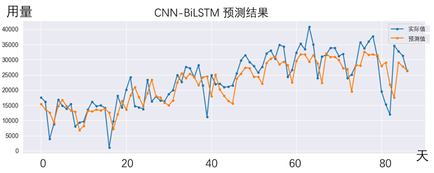
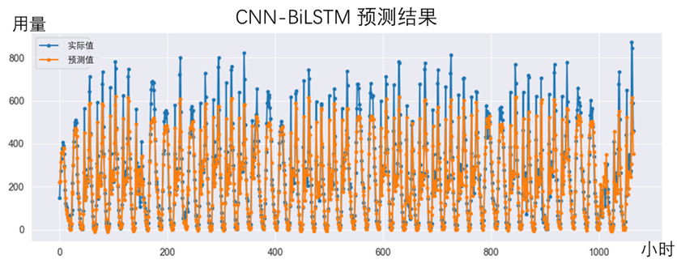
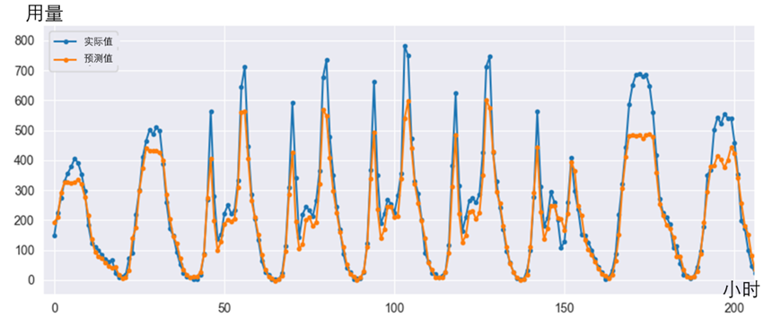
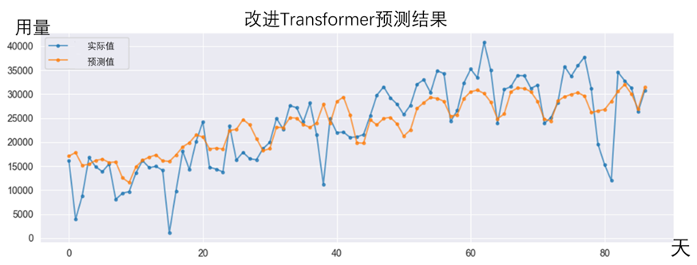
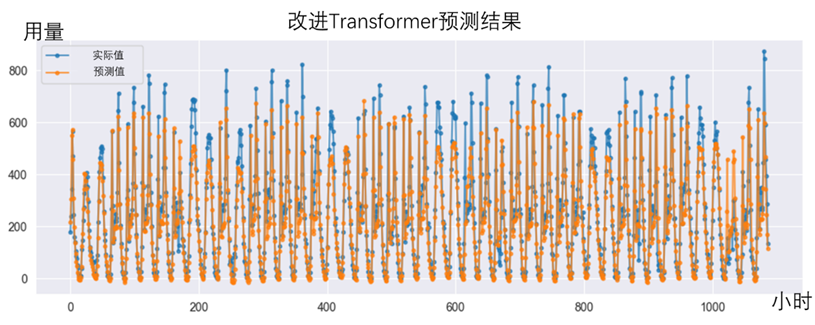

# 共享自行车用量预测
本项目搭建了两个深度学习模型（CNN-BiLSTM模型和改进Transformer模型），分别在两个共享自行车数据集上进行预测，预测效果较好。

## 数据来源
[纽约共享自行车数据集](https://github.com/toddwschneider/nyc-citibike-data)（800条日粒度数据）

[中国某市共2022享自行车数据集](https://github.com/108Starry-Sea/bike-sharing-kaggle-)（10000+条小时粒度数据）

## 运行环境
cuda环境

pytorch:2.5.1+cu124

## 备注

代码部分使用通义灵码、copilot进行修改润色，结果欠规范化，但是代码环境配好了都是可以运行的。

## 文件介绍
best_model：一些表现较好的模型

data：数据集

img：一些预测结果

output：数据分析中输出的图片和draw.io保存的绘图

base_model.py：三个基底模型（原生CNN、原生LSTM、原生Transformer）和两个改进模型，这个文件是存放用于比较的模型的。

cn_2022_lstm_test.py：使用训练好的CNN-BiLSTM模型在2022数据集上进行预测测试（此文件不含模型训练功能）。

cn_2022_lstm_train.py：使用2022数据集训练CNN-BiLSTM模型。

cn_2022_transformer_test.py：使用训练好的改进transformer模型在2022数据集上进行预测测试（此文件不含模型训练功能）。

cn_2022_transformer.py：使用2022数据集训练改进transformer模型。

data_analysis.py：对数据集进行的数据分析（比较乱）。

gpu_test.py：测试pytorch是否可以调用gpu。

model_comparison.py：五个模型（三个基底模型和两个改进模型，都是训练好的）在2022数据集上进行预测，比较预测表现。

torch_LSTM.py：使用纽约数据集训练CNN-BiLSTM模型。

traditional_model.py：使用不涉及神经网络的方法在2022数据集上进行用量预测。

train_base_model.py：用于训练三个基底模型。

train.xlxs：训练结果的记录（只记录了一部分）。

transformer_train：使用纽约数据集训练改进Transformer模型。

## 结果

